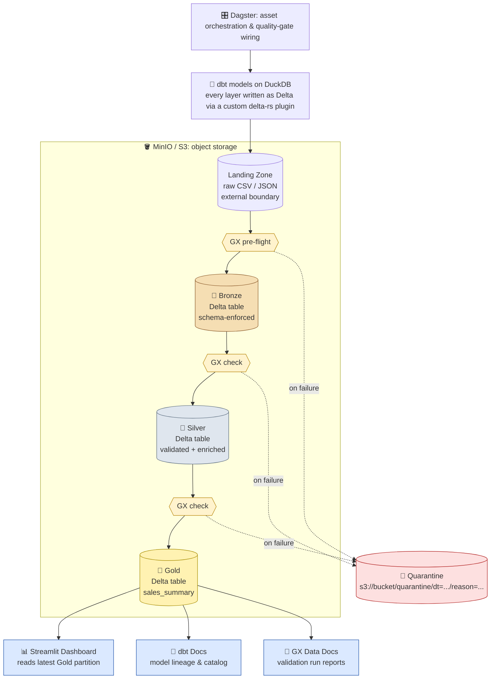

# PureFlow: Modern & Modular Data Lakehouse
### Data Engineering Capstone Project (TCC) - Medallion Architecture

**PureFlow** is a high-performance, **metadata-driven** data engineering platform. It implements a full Medallion Architecture as a real **lakehouse**: every curated layer (Bronze, Silver, Gold) is Delta Lake, not just files. The stack is 100% open-source, with dbt as the single transformation engine, integrated Data Quality (GX), and a robust DataOps CI/CD lifecycle.

---

## 🏗️ Architecture & Design Principles

The project is built on **Clean Architecture** and **SOLID** principles, ensuring that infrastructure, execution logic, and business rules are strictly decoupled.

### 1. Medallion Layers (S3-Native, Delta everywhere)
Data evolves through progressive layers in **MinIO (S3)**:
*   **Landing (Raw):** Source files (CSV/JSON) in their original format. It is the only layer that isn't Delta; it's the true external boundary, read by dbt via `meta.external_location` sources.
*   **Bronze (Standardized):** Schema-enforced Delta tables, produced by dbt models.
*   **Silver (Validated & Clean):** High-quality Delta tables after **Great Expectations** gates and SQL transformations, chained via `ref()`.
*   **Gold (Business Ready):** Aggregated Delta tables managed by **dbt**, ready for BI consumption.

dbt-duckdb doesn't write Delta natively (its bundled `delta` plugin only reads), so every model routes through a small custom write plugin, `src/dbt_plugins/delta_write.py`, configured project-wide in `dbt/dbt_project.yml` (`+plugin: delta_rw`). Each model just declares its `delta_table_path`; the plugin converts dbt's staged output into a real Delta table via `delta-rs`.

### 2. Quality Gates (Great Expectations)
Every domain gets two circuit breakers around its dbt models. Both are **declared as data** in `src/core/gates.py` (`SOURCE_GATES` / `TARGET_GATES`) and built into Dagster assets and checks by `src/orchestration.py`, so a gate is one table entry rather than a hand-written block:
*   **Pre-flight (source):** a Dagster asset (e.g. `sales_landing`) validates the raw landing file *before* the Bronze dbt model reads it. It matches the corresponding dbt `source()` by name, so it is a real upstream dependency in the asset graph. Raises and quarantines on failure, blocking Bronze from ever reading bad input.
*   **Post-write (target):** a Dagster `@asset_check` per model (`check_stg_sales_bronze_target`, `check_sales_silver_target`, ...) validates the model's output right after it is written, quarantining and failing the check (`blocking=True`) on failure.

Quarantined data is copied, never moved, to `s3://<source-bucket>/quarantine/dt=<date>/reason=<gate>/` so the offending records stay inspectable. A failure that is *technical* (storage unreachable, GX misconfigured) raises `ValidationTechnicalError` and is reported as `failure_type: technical` **without** quarantining: a gate that could not read the data has no basis to condemn it.

Each breaker has its own demo job, since a single run cannot show both: corrupt landing halts the pipeline before dbt ever materializes Bronze:

| Job | What it proves |
| :--- | :--- |
| `quality_test_landing_job` | Corrupts the raw files; the pre-flight gates refuse and quarantine them before dbt runs. |
| `quality_test_bronze_job` | Step two, after a clean `pureflow_pipeline_job`: overwrites the Bronze Delta tables with bad data and re-runs only their blocking gates. dbt is excluded from it, otherwise `dbt run` would rebuild Bronze from clean landing and erase the corruption before the gate could see it. |

### 3. Adding a New Pipeline
To wire up a new domain (e.g. `products`), only dbt files are needed, with no Python registration step:
1.  **A source** for the raw landing file, in a `sources.yml` under `dbt/models/`, using `meta.external_location` (see `dbt/models/landing/sources.yml`).
2.  **Bronze/Silver models**: `.sql` files under `dbt/models/products/bronze/` and `.../silver/`, following the pattern in `dbt/models/sales/`: `{{ config(delta_table_path=..., location=...) }}` at the top, `{{ source(...) }}`/`{{ ref(...) }}` in the `FROM` clause.
3.  *(Optional)* Quality gates: add a `SourceGate` and/or `TargetGate` entry to `src/core/gates.py`. No Python wiring: `orchestration.py` builds the asset and the `@asset_check` from the table, and `tests/test_asset_check_wiring.py` fails the build if the entry points at a model, source or S3 path key that does not exist.

Dropping the model files in is enough for Dagster to pick them up. `pureflow_dbt_assets` (`src/orchestration.py`) discovers every model from the dbt manifest automatically, no per-domain Python wiring.

---

## 🛠️ Tech Stack & Ecosystem

*   **Orchestration:** [Dagster](https://dagster.io/) (Asset-Based, Modern Orchestrator)
*   **Storage:** [MinIO](https://min.io/) (High-performance S3-Compatible Storage)
*   **Processing:** [DuckDB](https://duckdb.org/) (The "SQLite for Analytics" - Local-first OLAP)
*   **Quality:** [Great Expectations](https://greatexpectations.io/) (Dynamic Data Validation)
*   **Modeling:** [dbt](https://www.getdbt.com/) (Modular SQL transformations for every medallion layer) + [delta-rs](https://github.com/delta-io/delta-rs) (Delta Lake writes via a custom dbt-duckdb plugin)
*   **DataOps:** GitHub Actions + pre-commit (Automated Linting, Security, and Testing)
*   **Code Quality:** [Ruff](https://docs.astral.sh/ruff/) (lint + format) and [Bandit](https://bandit.readthedocs.io/) (security), enforced via pre-commit hooks
*   **Environment:** Docker & [uv](https://docs.astral.sh/uv/) (Python 3.12)

---

## 📂 Project Structure

```text
PureFlow/
├── .github/workflows/      # CI/CD DataOps Pipelines
├── dbt/                    # dbt Project (Bronze/Silver/Gold models, all Delta)
├── src/
│   ├── core/               # gates.py (declarative quality gates), config/paths,
│   │                       # connection, quarantine engine, GX context
│   ├── dbt_plugins/        # Custom dbt-duckdb plugin: writes Delta via delta-rs
│   ├── validation/         # Generic GX Validation Wrapper
│   └── orchestration.py    # Dagster Entrypoint, dbt asset wiring & quality-gate assets
├── tests/                  # Unit tests for core logic and generators
└── pyproject.toml          # Centralized Project Metadata & Config
```

---

## 🚀 Getting Started

### 1. Prerequisites
*   Docker Desktop (or Docker Engine) with **Compose v2**. Every command here uses `docker compose`, the subcommand; the old hyphenated `docker-compose` is not shipped by current Docker Desktop.
*   [uv](https://docs.astral.sh/uv/getting-started/installation/) (optional, only needed for local development outside Docker, e.g. running tests or pre-commit hooks)

Nothing else. No Python, no compiler, no Xcode Command Line Tools: see **Portability** below for what was verified.

### 2. Configure Environment
Copy the example environment file (required, MinIO will fail to start without it):
```bash
cp .env.example .env
```

### 3. Check the machine before launching
```bash
./scripts/doctor.sh
```
Verifies the Docker daemon, Compose v2, `.env`, the six published ports and free disk, and exits non-zero if anything is blocking. Worth running before a demo on a machine you have not used for this before.

### 4. Launch the Platform
```bash
docker compose up -d --build
```

> **Note (low-RAM machines):** the DuckDB resource limits (`DUCKDB_MEMORY_LIMIT`, `DUCKDB_THREADS` in `.env`) default to conservative values that fit inside Docker Desktop's default VM allocation. Raise them if you have given Docker more.

> **Note (Security):** all published ports are bound to `127.0.0.1`, so the stack is reachable only from the host machine, not from your local network, even though the default MinIO credentials are weak (fine for local dev, never expose these ports beyond localhost).

### 5. Monitoring & Access
| Tool | Endpoint | Description |
| :--- | :--- | :--- |
| **Dagster UI** | [http://localhost:3000](http://localhost:3000) | Pipeline Lineage & Execution |
| **Streamlit** | [http://localhost:8501](http://localhost:8501) | Business Insights Dashboard |
| **dbt Docs** | [http://localhost:8081](http://localhost:8081) | Data Documentation & Catalog |
| **GX Reports** | [http://localhost:8082](http://localhost:8082) | Data Quality HTML Reports |
| **MinIO Console** | [http://localhost:9001](http://localhost:9001) | S3 Object Browser |

### 6. Run the pipeline
The stack starts with empty buckets, so generate a landing zone first. Either use the Dagster UI (Jobs → Launch) or the CLI:

```bash
docker compose exec dagster dagster job execute -f /app/src/orchestration.py -j data_generation_job
docker compose exec dagster dagster job execute -f /app/src/orchestration.py -j pureflow_pipeline_job
```

| Job | Purpose |
| :--- | :--- |
| `data_generation_job` | Writes a **clean** landing zone (1M sales, 100k customers). Run this first. |
| `dirty_data_generation_job` | Writes a **dirty** landing zone instead. Separate job on purpose: both generators write the same paths, so selecting them together would race. |
| `pureflow_pipeline_job` | The pipeline itself: pre-flight gates → dbt (Bronze/Silver/Gold as Delta) → post-write gates. |
| `quality_test_landing_job` | Demo of the pre-flight breaker (expected to fail). |
| `quality_test_bronze_job` | Demo of the post-write breaker (expected to fail). Run after a clean `pureflow_pipeline_job`. |

---

## 📂 Documentation & Visuals

The project architecture and interface previews:

### 🏗️ Architecture Diagram
*High-level overview of the Medallion flow and technology stack.*



### 🚀 Dagster UI (Orchestration)

*Preview of the asset-based orchestration, lineage, and Metadata Plots.*

### 🧪 Data Quality Reports (GX)

*Detailed HTML reports generated by Great Expectations, served via HTTP.*

### 📖 dbt Documentation

*Model lineage and documentation generated by dbt.*

### 📦 MinIO Console (S3 Storage)

*S3-compatible storage browser showing the medallion buckets.*

---

## 💻 Local Development (Optional)

For editing code outside Docker (IDE support, running the quality hooks before you commit):
```bash
uv sync                # installs deps into .venv, pinned via uv.lock
uv run pre-commit install   # activates the git hook (runs automatically on every commit)
uv run pytest tests/
```

---

## 🛡️ DataOps & Quality Control

The project implements a mandatory **Quality Gate** before any data reaches the Silver/Gold layers. Locally, this gate runs as a **pre-commit** hook (`uv run pre-commit run --all-files` to run it on demand); in CI, the exact same hooks run via GitHub Actions so there's zero drift between what you see locally and what blocks a PR.
1.  **Linting & Formatting:** `ruff` (lint + format) and `sqlfluff` ensure Python and SQL standards.
2.  **Security:** `bandit` scans for vulnerabilities in the code.
3.  **Validation:** every landing source and every dbt model is gated by **Great Expectations**.
    *   **Metadata:** each check attaches the GX report URL, a `failure_type` (`none` / `data_quality` / `technical`) and, on a data-quality failure, the quarantine path, so the report link survives on the failed check itself.
4.  **Testing:** `pytest` covers the generators, the quarantine path logic, partition-date resolution, and the gate wiring.

---

## 💻 Portability

The stack runs natively on x86_64 and arm64, Linux, macOS (Intel and Apple Silicon) and Windows via WSL2. Two things were checked rather than assumed:

*   **Every image is multi-arch.** `python:3.12-slim`, `quay.io/minio/minio`, `quay.io/minio/mc` and `ghcr.io/astral-sh/uv` all publish `linux/arm64`, so an Apple Silicon machine builds and runs natively with no QEMU emulation. No `platform:` is pinned anywhere in `docker-compose.yml`, which is what would force emulation.
*   **Every dependency ships a prebuilt wheel.** Walking `uv.lock` with environment markers resolved for macOS arm64, Linux arm64 and Linux x86_64 gives 126-127 installable packages per platform, of which 107 are pure-Python and the rest have native wheels for that exact platform. Nothing compiles from source, so no toolchain is needed on the host. (`psutil` looks like an exception in the lock, which records only Windows wheels for it; that is correct, since Dagster declares it under `sys_platform == 'win32'` and it is never installed elsewhere.)

The one host-specific script is `scripts/setup_perms.sh`, which fixes bind-mount ownership on Linux and WSL. Docker Desktop on macOS and Windows maps permissions differently, so that script is not needed there and says so.

---

## 📏 Scope & Known Limitations

Design boundaries accepted on purpose. These are not bugs, but they are worth stating explicitly for the capstone defense:
*   **Single-node processing:** DuckDB is an embedded, single-machine OLAP engine (not distributed). Fine for the dataset sizes this project targets; a production-scale lakehouse would need Spark/Trino-class distributed processing.
*   **Dagster metadata storage:** run/event history is stored in local SQLite (`dagster_home/dagster.yaml`), which is appropriate for a single dev/demo instance but not for multi-user or HA deployments (Dagster supports Postgres for that).
*   **Partition date is resolved per step, not per run:** every asset resolves `dt=` independently from `core.config.today()` (UTC by default, see `PIPELINE_TIMEZONE`). A run that crosses midnight can therefore materialize one partition and validate another. Pin `execution_date_resource.date` in the run config for a backfill or a demo started near midnight.
*   **GX validation loads data into Pandas:** `validate_data()` (`src/validation/gx_validator.py`) pulls the full batch into memory via DuckDB → Pandas before validating. Works well at this project's scale (~1M rows with the default 4GB DuckDB memory limit); a larger dataset would need GX's SQL-native execution engine instead of the Pandas one.

---
*Developed as a Modular Data Platform for Senior Engineering Capstone.*
