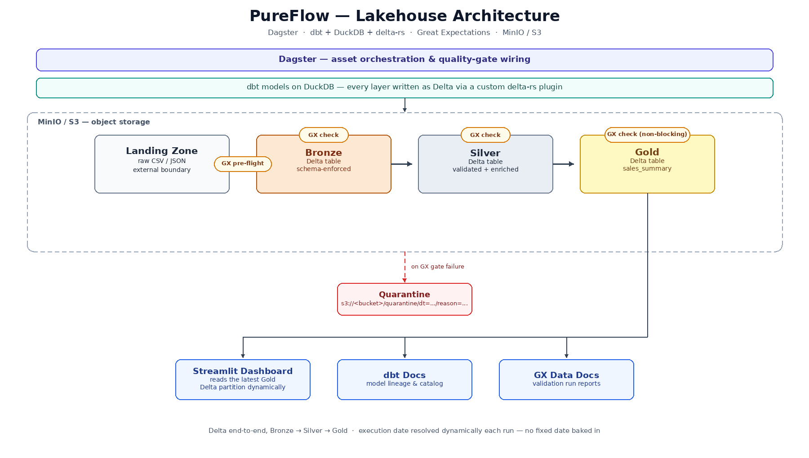

# PureFlow: Modern & Modular Data Lakehouse
### Data Engineering Capstone Project (TCC) - Medallion Architecture

**PureFlow** is a high-performance, **metadata-driven** data engineering platform. It implements a full Medallion Architecture as a real **lakehouse** — every curated layer (Bronze, Silver, Gold) is Delta Lake, not just files — using a 100% open-source stack, with dbt as the single transformation engine, integrated Data Quality (GX), and a robust DataOps CI/CD lifecycle.

---

## 🏗️ Architecture & Design Principles

The project is built on **Clean Architecture** and **SOLID** principles, ensuring that infrastructure, execution logic, and business rules are strictly decoupled.

### 1. Medallion Layers (S3-Native, Delta everywhere)
Data evolves through progressive layers in **MinIO (S3)**:
*   **Landing (Raw):** Source files (CSV/JSON) in their original format — the only layer that isn't Delta; it's the true external boundary, read by dbt via `meta.external_location` sources.
*   **Bronze (Standardized):** Schema-enforced Delta tables, produced by dbt models.
*   **Silver (Validated & Clean):** High-quality Delta tables after **Great Expectations** gates and SQL transformations, chained via `ref()`.
*   **Gold (Business Ready):** Aggregated Delta tables managed by **dbt**, ready for BI consumption.

dbt-duckdb doesn't write Delta natively (its bundled `delta` plugin only reads), so every model routes through a small custom write plugin — `src/dbt_plugins/delta_write.py` — configured project-wide in `dbt/dbt_project.yml` (`+plugin: delta_rw`). Each model just declares its `delta_table_path`; the plugin converts dbt's staged output into a real Delta table via `delta-rs`.

### 2. Quality Gates (Great Expectations)
Every domain gets two circuit breakers around its dbt models, both defined in `src/orchestration.py` and reusing the same `validate_data()`/`quarantine_data()` helpers:
*   **Pre-flight (source):** a plain Dagster asset (e.g. `sales_landing`) validates the raw landing file *before* the Bronze dbt model reads it — matches the corresponding dbt `source()` by name, so it's a real upstream dependency in the asset graph. Raises (and quarantines) on failure, blocking Bronze from ever reading bad input.
*   **Post-write (target):** a Dagster `@asset_check` per model (`check_stg_sales_bronze_target`, `check_sales_silver_target`, ...) validates the model's output right after it's written, quarantining and failing the check (`blocking=True`) on failure.

### 3. Adding a New Pipeline
To wire up a new domain (e.g. `products`), only dbt files are needed — no Python registration step:
1.  **A source** for the raw landing file, in a `sources.yml` under `dbt/models/`, using `meta.external_location` (see `dbt/models/landing/sources.yml`).
2.  **Bronze/Silver models** — `.sql` files under `dbt/models/products/bronze/` and `.../silver/`, following the pattern in `dbt/models/sales/`: `{{ config(delta_table_path=..., location=...) }}` at the top, `{{ source(...) }}`/`{{ ref(...) }}` in the `FROM` clause.
3.  *(Optional)* Quality gates — add a pre-flight asset and/or `@asset_check`s in `src/orchestration.py` following the existing `sales_landing`/`check_stg_sales_bronze_target` pattern.

Dropping the model files in is enough for Dagster to pick them up — `pureflow_dbt_assets` (`src/orchestration.py`) discovers every model from the dbt manifest automatically, no per-domain Python wiring.

---

## 🛠️ Tech Stack & Ecosystem

*   **Orchestration:** [Dagster](https://dagster.io/) (Asset-Based, Modern Orchestrator)
*   **Storage:** [MinIO](https://min.io/) (High-performance S3-Compatible Storage)
*   **Processing:** [DuckDB](https://duckdb.org/) (The "SQLite for Analytics" - Local-first OLAP)
*   **Quality:** [Great Expectations](https://greatexpectations.io/) (Dynamic Data Validation)
*   **Modeling:** [dbt](https://www.getdbt.com/) (Modular SQL transformations for every medallion layer) + [delta-rs](https://github.com/delta-io/delta-rs) (Delta Lake writes via a custom dbt-duckdb plugin)
*   **DataOps:** GitHub Actions + pre-commit (Automated Linting, Security, and Testing)
*   **Code Quality:** [Ruff](https://docs.astral.sh/ruff/) (lint + format) and [Bandit](https://bandit.readthedocs.io/) (security), enforced via pre-commit hooks
*   **Environment:** Docker & [uv](https://docs.astral.sh/uv/) (Python 3.12)

---

## 📂 Project Structure

```text
PureFlow/
├── .github/workflows/      # CI/CD DataOps Pipelines
├── dbt/                    # dbt Project (Bronze/Silver/Gold models, all Delta)
├── src/
│   ├── core/               # Shared Engine (path templating/quarantine), Connection & Quality logic
│   ├── dbt_plugins/        # Custom dbt-duckdb plugin: writes Delta via delta-rs
│   ├── validation/         # Generic GX Validation Wrapper
│   └── orchestration.py    # Dagster Entrypoint, dbt asset wiring & quality-gate assets
├── tests/                  # Unit tests for core logic and generators
└── pyproject.toml          # Centralized Project Metadata & Config
```

---

## 🚀 Getting Started

### 1. Prerequisites
*   Docker & Docker Compose
*   [uv](https://docs.astral.sh/uv/getting-started/installation/) (optional — only needed for local development outside Docker, e.g. running pre-commit hooks)

### 2. Configure Environment
Copy the example environment file (required — MinIO will fail to start without it):
```bash
cp .env.example .env
```

### 3. Launch the Platform
```bash
docker-compose up -d --build
```

> **Note (Apple Silicon / low-RAM machines):** the DuckDB resource limits (`DUCKDB_MEMORY_LIMIT`, `DUCKDB_THREADS` in `.env`) default to conservative values. If you have more RAM allocated to Docker Desktop, feel free to raise them.

> **Note (Security):** all published ports are bound to `127.0.0.1` — the stack is reachable only from the host machine, not from your local network, even though the default MinIO credentials are weak (fine for local dev, never expose these ports beyond localhost).

### 4. Monitoring & Access
| Tool | Endpoint | Description |
| :--- | :--- | :--- |
| **Dagster UI** | [http://localhost:3000](http://localhost:3000) | Pipeline Lineage & Execution |
| **Streamlit** | [http://localhost:8501](http://localhost:8501) | Business Insights Dashboard |
| **dbt Docs** | [http://localhost:8081](http://localhost:8081) | Data Documentation & Catalog |
| **GX Reports** | [http://localhost:8082](http://localhost:8082) | Data Quality HTML Reports |
| **MinIO Console** | [http://localhost:9001](http://localhost:9001) | S3 Object Browser |

---

## 📂 Documentation & Visuals

The project architecture and interface previews:

### 🏗️ Architecture Diagram

*High-level overview of the Medallion flow and technology stack.*

### 🚀 Dagster UI (Orchestration)

*Preview of the asset-based orchestration, lineage, and Metadata Plots.*

### 🧪 Data Quality Reports (GX)

*Detailed HTML reports generated by Great Expectations, served via HTTP.*

### 📖 dbt Documentation

*Model lineage and documentation generated by dbt.*

### 📦 MinIO Console (S3 Storage)

*S3-compatible storage browser showing the medallion buckets.*

---

## 💻 Local Development (Optional)

For editing code outside Docker (IDE support, running the quality hooks before you commit):
```bash
uv sync                # installs deps into .venv, pinned via uv.lock
uv run pre-commit install   # activates the git hook (runs automatically on every commit)
uv run pytest tests/
```

---

## 🛡️ DataOps & Quality Control

The project implements a mandatory **Quality Gate** before any data reaches the Silver/Gold layers. Locally, this gate runs as a **pre-commit** hook (`uv run pre-commit run --all-files` to run it on demand); in CI, the exact same hooks run via GitHub Actions so there's zero drift between what you see locally and what blocks a PR.
1.  **Linting & Formatting:** `ruff` (lint + format) and `sqlfluff` ensure Python and SQL standards.
2.  **Security:** `bandit` scans for vulnerabilities in the code.
3.  **Validation:** Every asset is checked by **Great Expectations**.
    *   **Observations:** Failed validations are recorded as `AssetObservation` in Dagster, preserving the report link even on failure.
    *   **Plots:** Numerical validation scores enable historical tracking via Dagster's Metadata Plots.
4.  **Testing:** `pytest` validates the underlying generators and core utilities.

---

## 📏 Scope & Known Limitations

Deliberate design boundaries — not bugs, but worth stating explicitly (e.g. for the capstone defense):
*   **Single-node processing:** DuckDB is an embedded, single-machine OLAP engine (not distributed). Fine for the dataset sizes this project targets; a production-scale lakehouse would need Spark/Trino-class distributed processing.
*   **Dagster metadata storage:** run/event history is stored in local SQLite (`dagster_home/dagster.yaml`), which is appropriate for a single dev/demo instance but not for multi-user or HA deployments (Dagster supports Postgres for that).
*   **GX validation loads data into Pandas:** `validate_data()` (`src/validation/gx_validator.py`) pulls the full batch into memory via DuckDB → Pandas before validating. Works well at this project's scale (~1M rows with the default 4GB DuckDB memory limit); a larger dataset would need GX's SQL-native execution engine instead of the Pandas one.

---
*Developed as a Modular Data Platform for Senior Engineering Capstone.*
